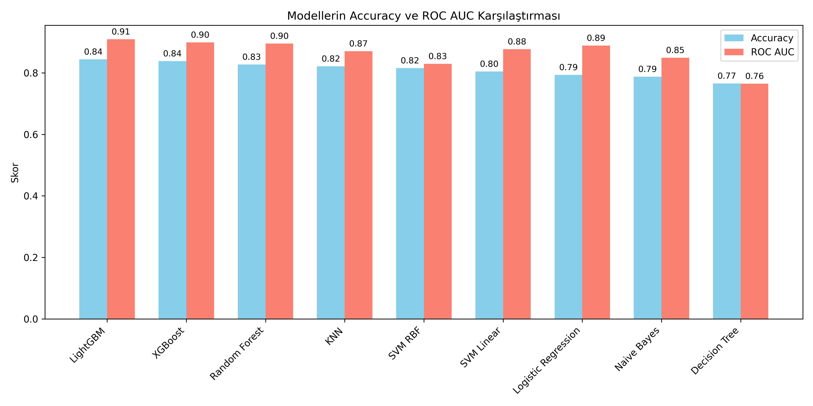

# Titanic Survival Prediction

Bu proje, Kaggle Titanic veri seti kullanılarak yolcuların hayatta kalıp kalmayacağını tahmin etmeyi amaçlamaktadır. Farklı makine öğrenmesi modelleri uygulanmış ve performansları ROC AUC ve Accuracy skorları ile karşılaştırılmıştır.

---

## ROC Curve Karşılaştırması

*Tuning öncesi ve sonrası LightGBM modeli ROC eğrisi.*

---

## Accuracy ve ROC AUC Karşılaştırması

*Farklı modellerin Accuracy ve ROC AUC skorları.*

---

## Kullanılan Kütüphaneler

- pandas, numpy
- scikit-learn
- matplotlib, seaborn
- XGBoost, LightGBM

---

## Yapılan İşlemler

1. **Veri Ön İşleme**
   - Eksik değerlerin doldurulması
   - Kategorik değişkenlerin encode edilmesi
   - Ölçekleme (StandardScaler)

2. **Modeller**
   - Logistic Regression
   - K-Nearest Neighbors (KNN)
   - Decision Tree
   - Random Forest
   - Naive Bayes
   - SVM (Linear & RBF)
   - XGBoost
   - LightGBM

3. **Model Değerlendirme**
   - Accuracy
   - Confusion Matrix
   - ROC AUC
   - ROC Curve görselleştirmesi

4. **Hyperparameter Tuning**
   - LightGBM modeli için GridSearchCV kullanıldı
   - En iyi parametreler ile model yeniden eğitildi
   - Tuning öncesi ve sonrası ROC AUC skorları karşılaştırıldı

---

## Sonuçlar

- Tuning öncesi LightGBM ROC AUC: 0.91
- Tuning sonrası LightGBM ROC AUC: 0.90

---
 Not: Küçük veri seti olduğu için bazı modeller overfitting gösterebilir.
